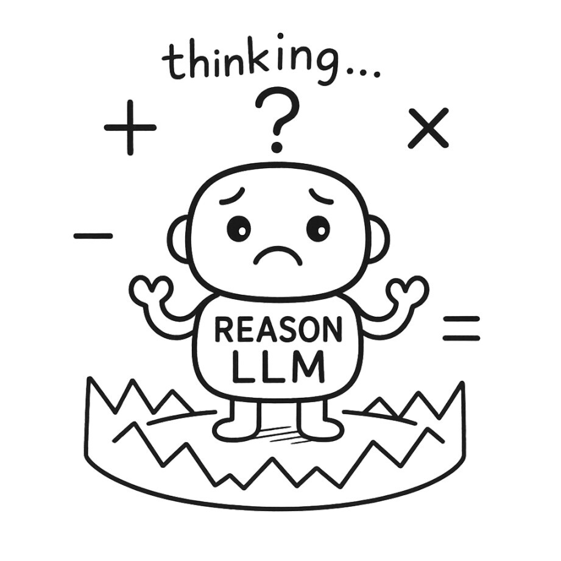

<!-- Banner -------------------------------------------------------------- -->
<h1 align="center">
  
  ReasoningTrap • Diagnosing Set for Instruction Overriding in Reasoning Models
</h1>

  <b>Fine-grain evaluation &amp; RL baselines for large language models that <i>think</i>.</b> 
  ConditionedMath (AIME &amp; MATH500) · PuzzleTrivial · Zero-shot pipelines

  
  
  

---

## 📜 Why ReasoningTrap?

> Current RL-tuned LLMs excel at *producing* answers, but often ignore explicit user constraints.  
> **ReasoningTrap** surfaces these failure modes with carefully crafted, *conditioned* problems.

* **Modified from Famous MATH Reasoning Benchmark** – AIME & MATH500 problems altered with minimal constraints to divert reasoning paths.
* **Puzzles Trivialized by Subtle Modifications** - Well-known puzzles where a small change transforms a challenging problem into a trivial one.
* **Plug-and-play** – evaluate any 🤗 Transformers, vLLM or OpenAI-style chat model in two lines.  

---

## 🚀 Quick start
